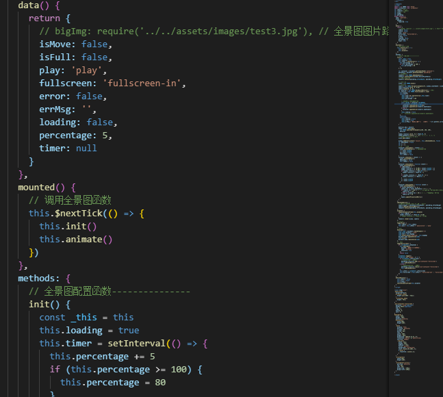

# photo_viewer
全景图查看
用插件photo-sphere-viewer发现有问题，图片过大，c盘内存小于大概5G就不行，加载不出来，可能图片预加载，具体搞不清楚，所以自己写了一个，还是可以加载的




#### 使用：
- 代码是一个组件，传入图片路径就可以了
- 遇到的问题，如果一个页面有两个地方用的同一张图报错
  `Failed to execute 'texImage2D' on 'WebGL2RenderingContext': Overload resolut`
每次传照片路径的地方，在路径后面加入时间戳就可以解决了

```
//引入组件photo，传入bigImg
  <el-dialog
      :title="photoSphereName"
      :visible.sync="visible"
      :footer="false"
      :append-to-body="true"
      custom-class="photo_wrap"
      width="70%">
      <photo :bigImg="bigImg" v-if="visible"></photo>
    </el-dialog>
```
```
//调用全景图的方法，img是传入的路径，如果不会重复图片可以不加时间戳
initPhotoSphere(name, img) {
      // img = img.replace('http://36.133.34.40:82/', '') + '?' + new Date().getTime()//解决跨域的
      img = img + '?' + new Date().getTime()
      this.photoSphereName = name
      this.visible = true
      this.bigImg = img
      
      //这下面是以前使用photo-sphere-viewer的方法，不必看
      // if (this.viewer) {
      //   this.viewer.destroy()
      // }
      // this.$nextTick(() => {
      //   this.viewer = new Viewer({
      //     container: document.querySelector('#viewer'),
      //     panorama: img,
      //     size: {
      //       width: '100%',
      //       height: '60vh'
      //     }
      //   })
      // })
    }
```


